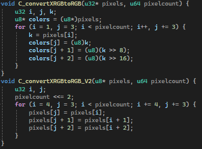
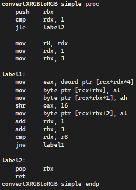
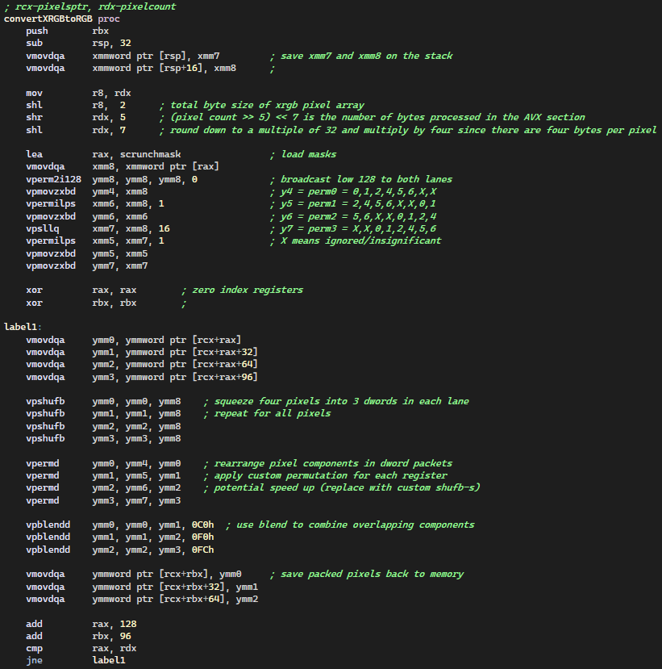
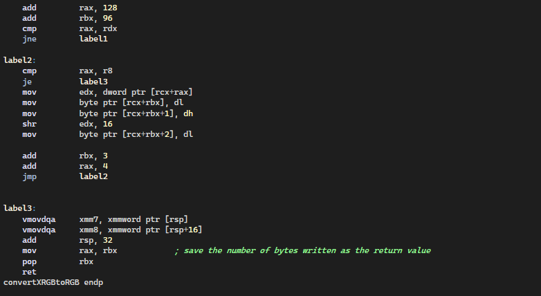
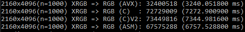

# XRGB TO PACKED RGB
Elias Malloy

The pixels of an image may be stored in a number of different ways. Today I will look at a few implementations of converting between an XRGB encoding of 24-bit color, to packed 24-bit RGB. XRGB is useful for referencing and manipulating pixels because each pixel is aligned to a four-byte memory address. XRGB pixels can be read and written in four byte blocks because of their alignment. The unused X is a major waste of space, especially in a rendered image. It's valuable to have an efficient way to convert between the two encodings so that you can take advantage of the strengths of each encoding at different stages of processing. We’ll first take a look at two similar c implementations of XRGB to RGB, the conversion I’m focusing on.

Version 2 is meant to be the simplest possible implementation, to get a sense of the performance you can expect from a function written quickly. Version 1 is almost as simple, but takes advantage of the 4-byte alignment of the XRGB pixels to save 2 memory reads. Version 1 is consistently 1% faster than version 2, which is not a great payoff for the added complexity.

Next we will look at a simple implementation in x64 assembly that is very similar to version 1 in C. I think this assembly procedure is nicely readable (for assembly), though there are definitely optimizations to be made, even without vectorization. This procedure earns a 7.5% speedup over version 1, which is starting to reach something significant. I think this type of optimization would be worth doing after recognizing a performance problem and identifying that this procedure was noticeably contributing to it. With an operation like this that is mostly memory access, implementing it in assembly can feel more ergonomic. I’ll continue to implement some functions like this because I think it is a valuable skill, but the performance increase isn’t that encouraging. The real way to distinguish yourself as a human writing assembly among your compiler peers, is to take advantage of vector instructions. Let’s see what that looks like!

(BREAK FOUR LINES REPEATED)

This procedure divides the workload into two stages: bulk processing of 32 pixels at a time, and then individual processing for the remaining pixels (always < 32). Using the AVX and AVX2 instruction set extensions we are able to load 8 XRGB pixels (256 bits) at a time. We begin the loop by loading four batches of 8 XRGB pixels and packing them into three batches of 10 and 2/3 RGB pixels(32 / 3). We then write the packed three batches and repeat the process. The packing of the pixels is somewhat intensive and could probably be optimized. This procedure took a long time to write and was difficult to decide on an approach to, which is due in part to my lack of experience writing AVX assembly. This type of code absolutely takes longer to write though and is a significant investment to make. That said this procedure gained a 124.5% speed improvement over the C version 1. This code is more valuable as a product because it performs better than what the c compiler produces for simple program code. This kind of performance is only achievable if you know something about optimization that lets you beat a simple solution. These c programs were compiled by the microsoft visual studio compiler in release mode with /arch:AVX2 enabled to give the compiler a chance to generate vector instructions (which in some areas it does).

This benchmark converted 1000 uncompressed 4k images with each of the different procedures. I was disappointed with the 2x speedup because it probably took about 400x as long to write the AVX procedure but I think it’s important that this is a memory bound operation which makes the speedup more notable to me.
